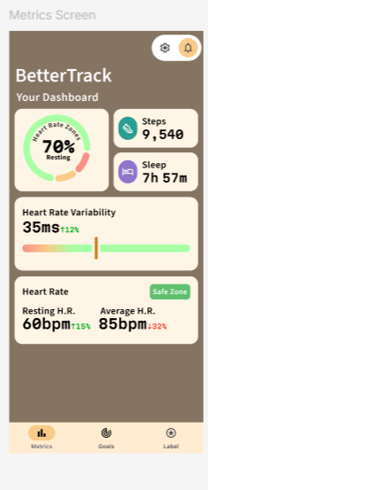

Monday 16th February

I did research on the data and stats we need to display in the app. This research includes What information is most necessary and most useful, and the best methods to display this on a small screen.
My research included:

1.How heart rate zones are calculated and what would be the best way for us to adjust these for our target clients (people with energy-limiting conditions)

2.What heart rate variation (HRV) is and how it affects energy levels and overall health

3.The nature of energy limiting conditions, the symptoms of them and how they can be tracked or adjusted to improve people's everyday lives

4.General app design research, mostly for fitness or health apps, seeing how much information should be on each page and how to streamline our app. Our target demographic might be not very tech-savvy and also may have low patience or concentration levels, so we focused on being able to access any information or feature in as few actions as possible

Additionally later on in the day I sat down with a friend who has CFS to ask about how it affects them and what features they think they would find useful in this type of app.

My team members, Jake and Asher had been creating a prototype on figma for our app which I contributed to by helping with some of the colour and style decisions and advising them based on my research about what information we should display on the homepage and how.
