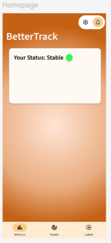

Friday 20th February

We began this day with another discussion on where we were planning to get to. We also discussed possibilities for a work schedule for the weeks in between the sprints. We aimed to finish off the issues we were currently working on, most of which were specific fixes and not very time consuming, then finalise our changes and arrive at a prototype that we were satisfied with. As I had reached a nice stopping point in the front-end programming tasks, I spent some time documenting the week and updating my reports for the project, as did other members of the team.

After this I played around with the colour scheme, as this was something the client had commented on, to find a more welcoming but still neutral colour set. On figma I began to design a new homepage, which was less overwhelming than our original idea. In order to simplify the layout, I wanted to design a feature that showed the user an overall "score" or "status" which culminates daily data and adivses how the user may be feeling based off of that. The progress made on the day is shown below.

Overall this day was not the most productive, as after the client meeting we had to backpedal and go into the planning stage again which halted progress. The week had been quite exhausting for us all so we worked casually to a natural stopping point, and finished the day early.