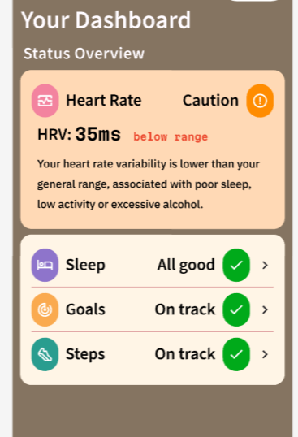

Today 3 of us worked on changing the UI design based on recommendations and criticism from our client meeting. The client suggested we simplify the dashboard as it was too cluttered and potentially overwhelming for users. Because of this we removed much of the data analytics from the dashboard, and replaced it with a set of status icons. Each icon represents one metric, and next to it is the status, telling the user if any of the data shows signs of a health hazard. Below is a screenshot of the figma design we made for this feature.

We also decided to reduce the number of pages so that everything is easier to access. Originally, pressing buttons on the homepage would take the user to a subpage, where it would show full analytics for whatever metric is pressed. We decided it would be better for these buttons to simply redirect the user to the section of the new "trends" page that corresponds to the button pressed. This way all of the analytics data is on the same page and users do not get lost in submenus, which helps usability and also allows the app to run more efficiently.

We think that these changes align with the feedback we received and that this will make the app much more user friendly and less overstimulating.

While this was done on the front end, El and Aidan worked on the back-end and database. They wrote methods to fetch data from the user's watch and write it into the database. They then tested their code to ensure that data was being loaded and stored correctly.