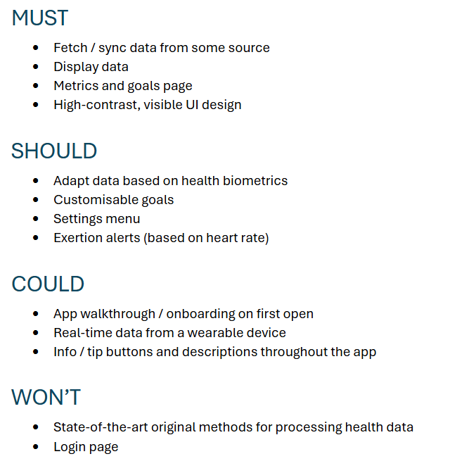

Week 2

To start the the session we had an introduction to GitHub and we went through a worksheet as a team to learn how to use GitHub effectively. After that we had our first direct correspondance with the client. The meeting was very informative and gave a good overview of the project. Learning about what Elaros specialise and meeting the people we would be working with helped us to understand the values of the company and therefore structure our planned app features based on that. Additionally they sent us a specification, and expanded on it during the meeting, which gave us specific guidelines to work with, such as having no login function in the app. After the meeting we began to brainstorm ideas and make a first MoSCoW analysis.

This analysis was based mainly on notes we had made from the meeting, and was planned to be used alongside the spec so where the MoSCoW is vague, the spec they provided would iron out the smaller details of what is needed.

We also set up systems we would need in order to collaborate on the project. We made a GitHub repository for the project, a shared OneDrive for planning and file sharing, and a discord server for communication.